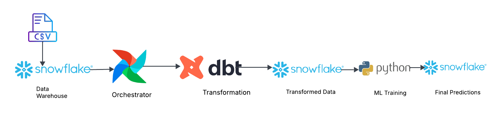

# 🛒 E-Commerce Churn Prediction Pipeline

<p align="left">
  
  
  
  
  
</p>

This project implements an end-to-end data engineering and machine learning pipeline to predict customer churn for an e-commerce platform. It leverages a modern data stack to automate data transformation, model training, and insight generation.

---

## 🏗️ Architecture
The pipeline follows a modular and automated flow, from raw data ingestion to ML-driven insights:

<p align="center">
  
</p>

1. **Data Warehousing:** Snowflake serves as the centralized source of truth.
2. **Orchestration:** Apache Airflow manages and schedules the entire workflow.
3. **Transformation:** dbt models raw e-commerce data into clean feature sets.
4. **Machine Learning:** Python (Scikit-Learn) trains the model and generates predictions.

---

## 🛠️ Tech Stack
* **Language:** Python 3.10
* **Data Warehouse:** Snowflake
* **Workflow Management:** Apache Airflow
* **Data Transformation:** dbt (Data Build Tool)
* **ML Library:** Scikit-Learn
* **Environment Management:** WSL (Ubuntu), Python-dotenv

---

## 🚀 Key Features
* **Automated Feature Engineering:** Using dbt to transform raw e-commerce data into a `FCT_CUSTOMER_BEHAVIOR` table.
* **Scalable ML Training:** Automated Python script that trains a Logistic Regression model on the latest Snowflake data.
* **Prediction Loopback:** Model results (Actual vs. Predicted) are automatically written back to Snowflake for business intelligence.
* **Security:** Implemented environment variable management (`.env`) to secure sensitive database credentials.

---

## 📁 Project Structure
```text
├── airflow/dags/       # Airflow DAG definitions for orchestration
├── dbt_project/        # dbt models for cleaning and feature store creation
├── ml_scripts/         # Python scripts for ML training and result uploading
├── models/             # SQL definitions for dbt transformations
└── README.md           # Project documentation
